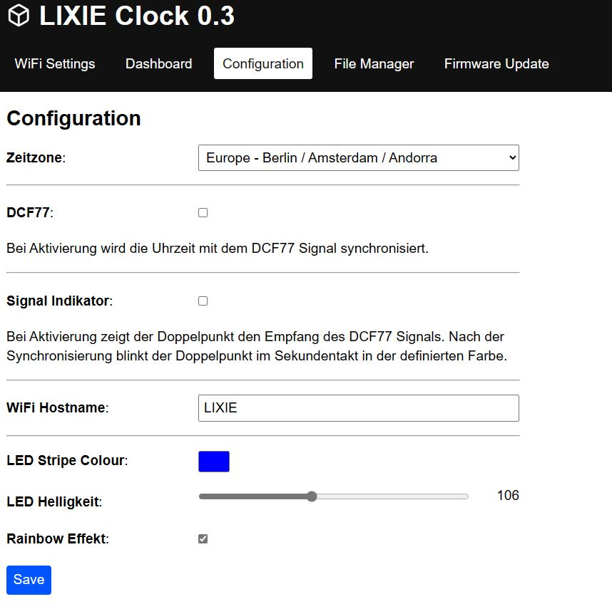

# LIXIE Clock with DCF77 encoder

## Description
This project is a full source to create a LIXIE clock with DCF77 support and Webpage to configure the clock. 

## Features
- the code creates a filesystem on flash storage of the esp8266
- all settings are stored on the filesystem in a JSON format
- Wifi-Manager for easy connection to available AccessPoints
- Webpage to configure all settings or read the values
- OTA Over-The-Air update of firmware
- Color picker for full colors
- Rainbow effekt (changes color)
- Indicator for DCF77 signal

## Hardware
- 3mm HDF wood
- 2mm acrylic
- ESP8266 based mcu like D1 mini or NodeMCU
- 

## ToDo
- Additional sensors like BMP280, BME280, SHT3x
- Pushbuttons to configure the clock
- Alarm mode
- DCF77 enable pin declaration (no need wire-bridge to GND)
- Time set from dashboard

## Schematic

| NodeMCU Board Pins |     | Device Pin         | Device Name  |   
|--------------------|-----|--------------------|--------------|      
| GPIO3              | RX  | Data in            | WS2812B LED  |   
| Vin or 5V          | Vin | +5V                | WS2812B LED  |
| GND                | GND | GND                | WS2812B LED  |
| GPIO14             | D7  | DCF77 signal       | DCF77        |
| GPIO12             | GND | GND                | DCF77        |
| GPIO13             | VDD | DCF77 Enable       | DCF77        |

## Weblinks to get running
- http://www.kidbuild.de or https://shop.kidbuild.de
E-Mail info@kidbuild.de

## Credits
https://www.thingiverse.com/thing:5763808
ala Creasento
